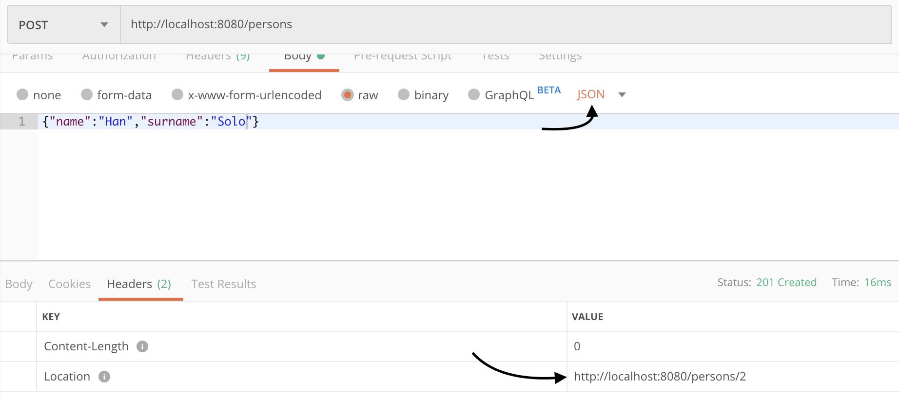

:icons: font
== Chapter 1 - Rest Services with Quarkus

=== Requisites

- You need a terminal with a shell that you like as: bash, zsh, cmd, etc.
Internet connection.
- Java JDK 8 or 11+ distribution https://adoptopenjdk.net/
- Apache Maven 3.5.3+ https://maven.apache.org/
- A text editor or and IDE as you feel more confortable.

=== Preparing environment

Move to a parent folder where you want have new project.

To create a new project write this maven command:

[source,shell script]
----
$ mvn io.quarkus:quarkus-maven-plugin:1.1.0.Final:create \
   -DprojectGroupId=cat.udl.example \
   -DprojectArtifactId=quarkus-example \
   -DprojectVersion=0.1 \
   -DclassName="cat.udl.Example"
----

CAUTION: Be careful with double quotes that it shouldn't be typographic.

TIP: You can personalise values (more info in https://quarkus.io/guides/maven-tooling) Open folder with project artefact name with your favourite IDE.

=== Running for first time

The project was created with an example class with a sample Rest service.
You could open src/main/java/cat/udl/Example.java an observe.

In order to try this example you can run this project by typing in your terminal:

[source,shell script]
----
$ ./mvnw compile quarkus:dev
----

Go to your browser and write this url : http://localhost:8080/hello

You can change and modify Example class and the plugin dev of quarkus detect and make available to your browser immediate you only need to reload.

You could stop server by pressing ``Ctrl + C``.

=== Json Rest Service - GET

Stop server if you still have it running.

Quarkus base installation doesn’t have the capacity to serialise data to json format.
We need to add an extension to add this feature.
From terminal you could add this with this command:

[source,shell script]
----
$ ./mvnw quarkus:add-extension -Dextensions="io.quarkus:quarkus-resteasy-jackson"
----

Next we create a new Class in order to manage and publish data.
This class also could be named as POJO (Plain Old Java Object), DTO (Data Transfer Object) or simply Model Class.
In this example we create class named Person and add name and surname as a String attributes.
It’s recomendable that these attributes are private and create getters and setters, create a no parameters constructor and also it could create a full parameras attribute:

[source,java]
----
public class Person {

    private String name;
    private String surname;

    public Person() {
    }

    public Person(String name, String surname) {
        this.name = name;
        this.surname = surname;
    }

    public String getName() {
        return name;
    }

    public void setName(String name) {
        this.name = name;
    }

    public String getSurname() {
        return surname;
    }

    public void setSurname(String surname) {
        this.surname = surname;
    }
}
----

Copy class Example class to new PersonService class.

Focus on Annotation Produces of hello method in class Example.
This annotation “says” mime type of data and this set how it must be presented by default it is set with `TEXT_PLAIN`.
We change this with `APPLICATION_JSON` type.
We change return type with object that we were created and change body of method creating a sample object and returning this.
Change `@Path_` annotation of class value to persons too.

[source,java]
----
@Path("/persons")
public class PersonService {

    @GET
    @Produces(MediaType.APPLICATION_JSON)
    public Person getPerson() {
        Person person = new Person("Obi-Wan", "Kenobi");
        return person;
    }
}
----

IMPORTANT: Change @Path("/hello") with @Path("/persons") at next section it was explained why.

Start server and in your browser change hello of url by persons . You could see you object in json format.

=== Json Rest service - Query Parameters

Query parameters are called the parameters that are jointly with the url. The fists parameter is written next url,
it starts with question mark `?` then key and value separated with equal  `=`.
Next parameters are separated by ampersand `&` and key value separated with equal `=` too.

.Example url with query parameters
[url]
----
http://localhost:8080/persons?skip=1&limit=1
----

To collect this parameters we need the annotation @QueryParameter. This annotation can be used in different ways,
for example as a decorator of parameter of a method or of a class attribute.

We can control if parameter es omitted we can set a default value and manage a default behaviour. Is needed a other
annotation `@DefaultValue` to control this.

The type is automatically converted and if type could fit throw a 404 page.

.Get example with QueryParams
[source, java]
----
@GET
@Produces(MediaType.APPLICATION_JSON)
public List<Person> getAll(@QueryParam("limit") @DefaultValue("10") int limit,
                           @QueryParam("skip") @DefaultValue("0") int skip) {
    return personsRepository.getAll().stream()
        .skip(skip)
        .limit(limit)
        .collect(Collectors.toList());
}
----

You could try before url and you obtaind a only one result and is the second element of array (limit 1, skip 1).

=== Json Rest Service - Path Parameters

Best practices of rest services suggest that the url defines the resource that we like to access.
For this reason “hello” in our url isn’t correct and we shout change with "persons" on `@Path` class annotation that it identifies better our resources.
The annotation `@Path` could be on class and on methods and it was defining an hierarchy uri.
This best practices also says that if we make a query to get this top resource of persons we retrieve all resources so that we need to return a List of all Persons.

[source,java]
----
@GET
@Produces(MediaType.APPLICATION_JSON)
public List<Person> getAll() {
    Person person1 = new Person("Obi-Wan", "Kenobi");
    Person person2 = new Person("Leia", "Organa");
    return Arrays.asList(person1,person2);
}
----

If we get only one of this persons we can define a `GET` method with a specific resource of this for example `persons/0` or `persons/1`. We can put a Path param as a next sample:

[source,java]
----
@Path("/persons")
public class Example {
    @GET
    @Path("{id}")
    @Produces(MediaType.APPLICATION_JSON)
    public Person hello(@PathParam("id") int id) {
        Person person1 = new Person("Obi-Wan", "Kenobi");
        Person person2 = new Person("Leia", "Organa");
        List<Person> people = Arrays.asList(person1, person2);
        if (id>=0 && id<people.size()){
            return people.get(id);
        }
        throw new NotFoundException(); // to return 404
    }
}
----

You can notice that we throw a `NotFoundException` if the resource not exist this exception produces a 404 response code, it’s a convention to define that resource not exist.

=== Json Rest Service - POST, PUT, DELETE, PATCH

Best practices of defining rest services defining that the URI defines de resource and HTTP methods define the action.
We resume this actions at next table:

[%header,cols="1,5",width="80%",align="center"]
|=========================================================
|METHOD |ACTION
|GET    |Retrieve information
|POST   |Create a new resource  (creating new key)
|PUT    |Create or update a new resource (key is set in url)
|DELETE |Remove a resource.
|PATCH  |Update partial information of resource
|=========================================================

In previous section we test with `GET` method and with a browser we can test easily this but other methods we next some tool to test.
You could download a plug-in of your browser or you can download some tool as postman (https://www.getpostman.com/) or Insomnia (https://insomnia.rest/).

==== POST

When we need to create a new resource and a new url that identify this we use a post method.
This method should receive data and store this for this examples we don’t still use database and use Lists as example in an Application scoped class.

First we create a Repository class in-memory with 2 persons as first example. We use an @ApplicationScoped` of CDI specs that it helps to maintain same instance during all application live.

[source,java]
----
@ApplicationScoped
public class PersonsRepository {

    ArrayList<Person> personList;

    @PostConstruct
    public void init() {
        personList = new ArrayList<>();
        Person person1 = new Person("Obi-Wan", "Kenobi");
        Person person2 = new Person("Leia", "Organa");
        personList.add(person1);
        personList.add(person2);
    }

    public List<Person> getAll(){
        return personList;
    }

    public Optional<Person> get(int id) {
        if (id >= 0 && id < personList.size()) {
            return Optional.of(personList.get(id));
        }
        return Optional.empty();
    }

    public int add(Person person){
        personList.add(person);
        return personList.size()-1;
    }

    public Optional<Person>  replace(int id, Person person){
        if (id >= 0 && id < personList.size()) {
            personList.set(id, person);
            return Optional.of(person);
        }
        return Optional.empty();
    }

    public Optional<Person>  remove(int id){
        if (id >= 0 && id < personList.size()) {
            return Optional.of(personList.remove(id));
        }
        return Optional.empty();
    }
}
----

Next we replace `GET` methods to use new Repository class.
We inject Repository (it’s mandatory to use a default protection of injected attribute)

[source,java]
----
@Inject
PersonsRepository personsRepository;

@GET
@Produces(MediaType.APPLICATION_JSON)
public List<Person> getAll() {
    return personsRepository.getAll();
}

@GET
@Path("{id}")
@Produces(MediaType.APPLICATION_JSON)
public Person get(@PathParam("id") int id) {
    return personsRepository.get(id)
        .orElseThrow(NotFoundException::new);
}
----

We can create a `POST` method.
When we create a resource by using a `POST` method best practices define that we may return a 201 status code and a pointer to resource that we create this resource.

[source,java]
----
@POST
@Consumes(MediaType.APPLICATION_JSON)
@Produces(MediaType.APPLICATION_JSON)
public Response add(Person person, @Context UriInfo uriInfo) {
    int id = personsRepository.add(person);
    UriBuilder builder = uriInfo.getAbsolutePathBuilder();
    builder.path(Integer.toString(id));
    return Response.created(builder.build()).build();
}
----

You should put your attention in a new Annotation Consumes that this indicates what is the format of data that it accepts . The data is received by de parameter of method , in this case a Person.
`@Context UriInfo` is an auxiliary parameter that JAX-RS could provide that it helps to make a response resource url.

Now we can test new url in browser:

==== PUT

Put is a method to replace an a resource.
This may accomplish the property of idempotent, so that this returns the resource.

[source,java]
----
@PUT
@Path("{id}")
@Consumes(MediaType.APPLICATION_JSON)
@Produces(MediaType.APPLICATION_JSON)
public Person replace(@PathParam("id") int id, Person person) {
    return personsRepository.replace(id, person)
        .orElseThrow(NotFoundException::new);
}
----

We try to replace resource `/persons/1` You can view a result in your browser:

==== DELETE

Delete method as his name says it remove a resource.

[source,java]
----
@DELETE
@Path("{id}")
@Produces(MediaType.APPLICATION_JSON)
public Person remove(@PathParam("id") int id) {
    return personsRepository.remove(id)
        .orElseThrow(NotFoundException::new);
}
----

Let’s try it.

View result in browser:

==== PATCH

When when you need to update a resource but you don't like to send all resource, you can do a patch sending only the
information that you like to change. So that you can do a partial modification of a resource.

To do this modifications is used a special json structure (http://jsonpatch.com/) that define the operations that have to
do on the original resource (add, replace, remove, etc.).

Jax-rs spec is prepared to manage this and is so easy to manage. This type of json has its own mime-type for this reason `@Consumes`
annotation need to manage this type with `MediaType.APPLICATION_JSON_PATCH_JSON`. When system receives a query of a Http Patch method
it automatically make a call to get function to obtain an orginal data, next apply patch and offer this modified object as an argument
of method. We could call replace method to save object modified if we don't like to do anything more.

[source,java]
----
@PATCH
@Path("{id}")
@Consumes(MediaType.APPLICATION_JSON_PATCH_JSON)
@Produces(MediaType.APPLICATION_JSON)
public Person update(@PathParam("id") int id, Person person) {
    return replace(id, person);
}
----

You could make some test with this json examples:

.Replace values
[source,json]
----
[ { "op": "replace", "path": "/name", "value": "name_changed" } ]
----

.Remove values
[source,json]
----
[ { "op": "delete", "path": "/name"} ]
----

.Add value
[source,json]
----
[ { "op": "add", "path": "/name", "value": "Obi-Wan"} ]
----

You could see an example with postman:

Important content-type header must bé: `application/json-patch+json`

=== Run in Docker Container

First you need to make a Dockerfile.
This file is a description how to build a container.

[source,dockerfile]
----
FROM openjdk:8-jre-slim
RUN mkdir -p /opt/app/lib
COPY target/lib/*.jar /opt/app/lib/
COPY target/quarkus-example-0.1-runner.jar /opt/app/
EXPOSE 8080
CMD ["java", "-jar", "/opt/app/quarkus-example-0.1-runner.jar"]
----

It starts from a base with system and java jre installed.
Next we create a path and copy own jar on this and finally start service.
We need to indicate what pots can be exposed.

To make a jar that will be copied we need to stop quarkus and run next maven command from Terminal.
You need to have a HelloService as when you created project in order to accomplish test that project has as an example.

[source,shell script]
----
$ mvn package
----

Next we could build a container from our Dockerfile.

[source,shell script]
----
$ docker build . -t quarkus-example
----

Docker starts to download and build a new image.
When it ends we can view all images that docker have.
We can view our image tagged with latest.

[source,shell script]
----
$ docker images
REPOSITORY                  TAG           IMAGE ID            CREATED             SIZE
quarkus-exam                latest        8a5626098a4d        4 minutes ago       184MB
----

Now we can start this image and test if it works correctly (it’s important you stop before if you have still running the project).

[source,shell script]
----
$ docker run -d -p 8080:8080 --name quarkus-example quarkus-example:latest
----

We can repeat all operations that we do when application was running directly on our terminal.