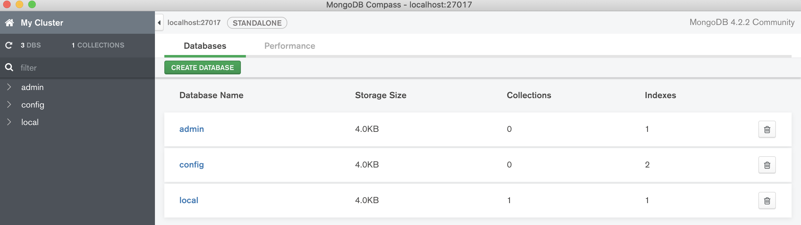

:icons: font
== Part 2 - Running Mongo as a Docker container

=== Requisites

- You need a terminal with a shell that you like as: bash, zsh, cmd, etc.
- Docker: https://docs.docker.com/install/
- MongoDB compass: https://docs.mongodb.com/compass/master/install/
- A text editor or and IDE as you feel more confortable.

=== Verifying installation of Docker

Open your Terminal and verify you have installed docker CLI.

[source,shell script]
----
$ docker —version
Docker version 19.03.2, build 6a30dfc
----

And verify you have started docker service.

#Without service:#

[source,shell script]
----
$ docker version

Client: Docker Engine - Community
Version:           19.03.2
API version:       1.40
Go version:        go1.12.8
Git commit:        6a30dfc
Built:             Thu Aug 29 05:26:49 2019
OS/Arch:           darwin/amd64
Experimental:      false
Cannot connect to the Docker daemon at unix:///var/run/docker.sock. Is the docker daemon running?
----

#Within service:#

[source,shell script]
----
$ docker version

Client: Docker Engine - Community
Version:           19.03.2
API version:       1.40
Go version:        go1.12.8
Git commit:        6a30dfc
Built:             Thu Aug 29 05:26:49 2019
OS/Arch:           darwin/amd64
Experimental:      false

Server: Docker Engine - Community
Engine:
Version:          19.03.2
API version:      1.40 (minimum version 1.12)
Go version:       go1.12.8
Git commit:       6a30dfc
Built:            Thu Aug 29 05:32:21 2019
OS/Arch:          linux/amd64
Experimental:     false
containerd:
Version:          v1.2.6
GitCommit:        894b81a4b802e4eb2a91d1ce216b8817763c29fb
runc:
Version:          1.0.0-rc8
GitCommit:        425e105d5a03fabd737a126ad93d62a9eeede87f
docker-init:
Version:          0.18.0
GitCommit:        fec3683
----

=== Starting Mongo

We can get help how to start mongo from docker hub: https://hub.docker.com/_/mongo

Start mongo:

[source,shell script]
----
$ docker run --name mongodb mongo:latest

Docker automatically download de image and start this. It take a while.
Unable to find image 'mongo:latest' locally
latest: Pulling from library/mongo
2746a4a261c9: Downloading [===================>                               ]  10.57MB/26.69MB
4c1d20cdee96: Download complete
0d3160e1d0de: Download complete
c8e37668deea: Download complete
fc3987a82b4c: Download complete
c75f139e0836: Downloading [===========>                                       ]  686.8kB/2.982MB
4acc9c8680b4: Downloading [===>                                               ]  441.6kB/5.763MB
fb02df30d947: Waiting
ae725ef3d2ce: Waiting
e30f54ed6b43: Waiting
bca9e535ddb8: Waiting
9c3edad81b2a: Pulling fs layer
6dbcf78fe5ae: Waiting
----

Open another Terminal and we can interact with shell of container .

[source,shell script]
----
$ docker exec -it mongodb bash
----

We can open a cli of mongo and interact with mongo:

[source,shell script]
----
# mongo
/../
> show dbs
admin   0.000GB
config  0.000GB
local   0.000GB
----

We can create our db and save some data:

[source,javascript]
----
> use testdb          // automatically creates schema
switched to db testdb
> db.people.save({ firstname: "Obi-Wan", lastname: "Kenobi" })
WriteResult({ "nInserted" : 1 })
> db.people.save({ firstname: "Leia", lastname: "Organa" })
WriteResult({ "nInserted" : 1 })
----

We can retrieve data:

[source,javascript]
----
> db.people.find()
{ "_id" : ObjectId("5e086af751c59585c51247a3"), "firstname" : "Obi-Wan", "lastname" : "Kenobi" }
{ "_id" : ObjectId("5e086b0e51c59585c51247a4"), "firstname" : "Leia", "lastname" : "Organa" }

> db.people.find({"firstname":"Leia"})
{ "_id" : ObjectId("5e086b0e51c59585c51247a4"), "firstname" : "Leia", "lastname" : "Organa" }
----

Type `exit` twice to go out of container.

Go to Terminal that have mongo container started and press `Ctrl + C` to stop this.

We can restart container and try to get data but we can’t retrieve any saved data because containers are ephemeral and when it stops they don’t maintain any changes of this.

docker container restart mongodb

You can stop and delete this and the end.
Any start of mongo with the same name you need to do this.

[source,shell script]
----
$ docker container stop mongodb
$ docker container rm mongodb
----

Docker allow us to bind persistent volume in order to don’t loose data.
The simplest way is map a local path to path of container.
So that, we maintain data outer of container and container continue being ephemeral.
We added -d option to start in detached mode.

[source,shell script]
----
$ docker run --name mongodb -v /my/own/datadir:/data/db -d mongo:latest
----

Finally if we like to access from external of container we can map ports.

[source,shell script]
----
$ docker run -d -p 27017:27017 --name mongodb mongo:latest
----

We can connect with compass with default values.
Open compass and simply click connect.

Finally you can do all binds.
You can bind a persistent volume and a map a port:

[source,shell script]
----
$ docker run --name mongodb -v /Users/sta/mongo:/data/db  -p 27017:27017  -d mongo:latest
----

At this point you have a mongodb running and prepared to start to use this in develop environment.